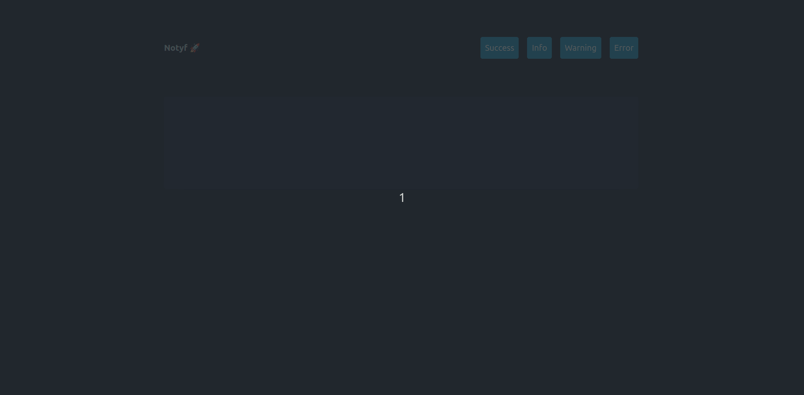

# Notyf (with Symfony)

Educational project on the use of [Notyf](https://carlosroso.com/notyf/) in a Symfony project with Webpack Encore to display better notification messages.

For the Youtube channel [YoanDev](https://www.youtube.com/c/yoandevco) and the blog [yoandev.co](https://yoandev.co).



## 🏁 Prerequisites

* [Symfony CLI](https://symfony.com/download)
* [PHP 8.1](https://www.php.net/downloads)
* [Composer](https://getcomposer.org/)
* [NPM](https://nodejs.org/en/download/)

## 🔥 Install and play

```bash
composer install
npm install
npm run build
symfony serve -d
``` 